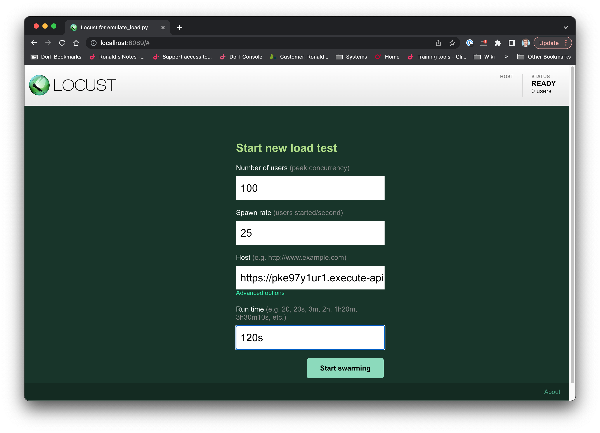
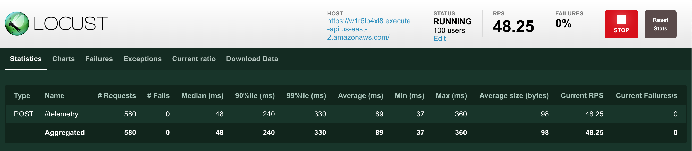
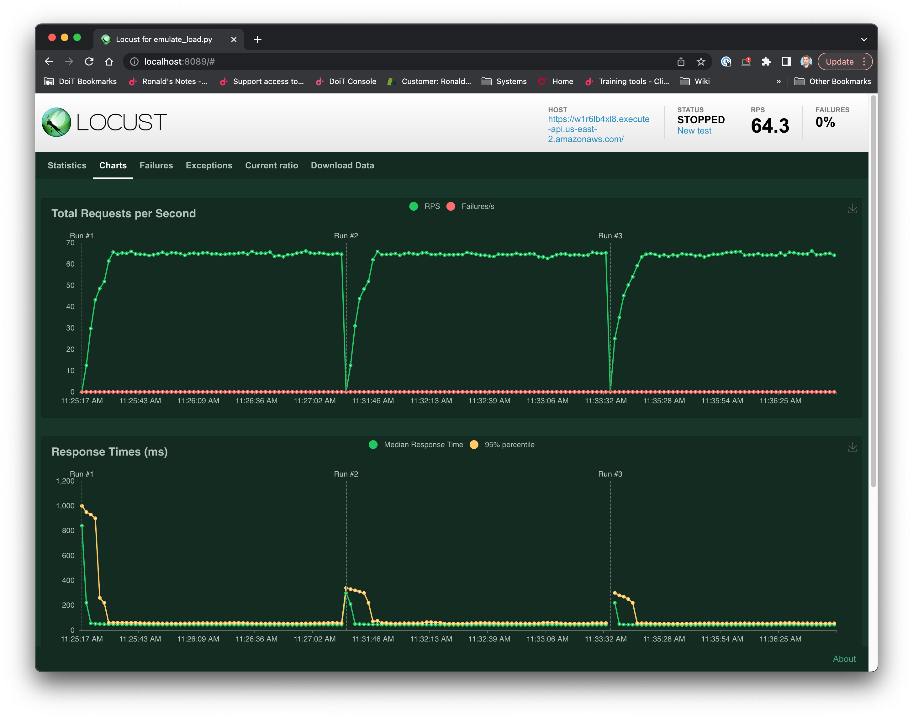
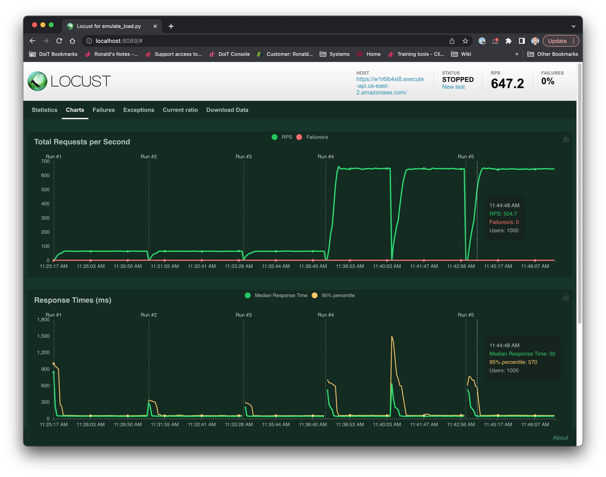
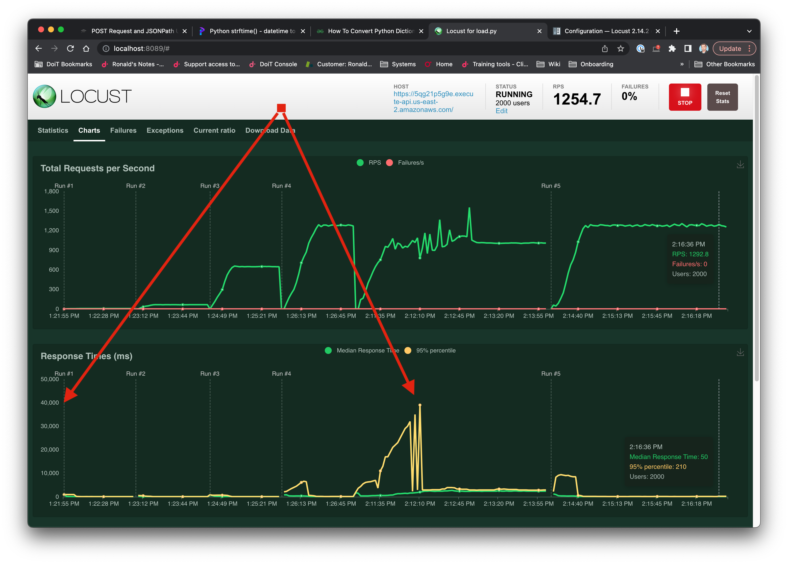
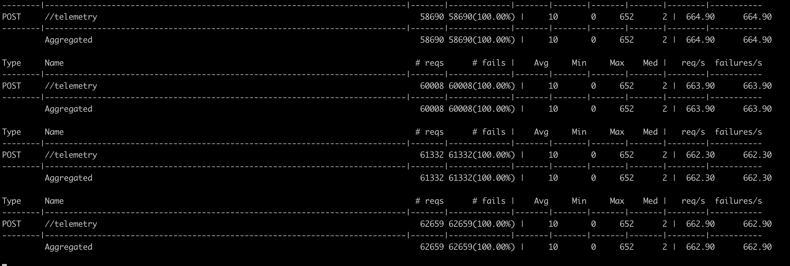

# Lesson 3

## Load Test our API

For this lesson we will use the existing Python virtual environment used in [Lesson 2](../lesson2/README.md) as this does not impact that prior work.

## AWS Lambda Infrastructure
If you cleaned up your AWS resources in [Lesson 2](../lesson2/README.md) you get a ⭐, however you will need to re-create them and collect the value of the `URL` variable.

For example:
```
echo ${URL}
https://w1r6lb4xl8.execute-api.us-east-2.amazonaws.com
```

# Install necessary Python packages

We will be using the Python library [Locust](https://locust.io/) for our load testing.

```
# In /lesson3 directory
pip install -r src/requirements.txt
```

## Interactive Locust testing

To use Locust in an interactive mode.
```
cd src
locust -f test/emulate_load.py     ## TODO background and log to file
# In separate session
open http://localhost:8089
```

You will be prompted with a simple interface. Enter these values:
* Number of Users = 100
* Spawn Rate = 25
* Host = \<the value of URL>
* Run Time = 120  (you may have to click on the advanced options link)




Click the Start Swarming button.


Initially you will provided with the Statistics view, a text based table.


Click on the Charts tab for an interactive graphical view. When completed you can review the graph via a mouseover to see your total RPS and the lambda response times.  As with any testing, it's good to run multiple iterations, so when the test is completed click on the New Test link and Start Swarming.  This is what it looks like after 3 tests of 120s each with the same parameters.

As you can see, the initial invocation of the lambda is expensive in execution time, however it quickly maintains a consistent response.




This is what it looks like when we start sampling with 1000 users.




Here is an example of prior test run that showed an abnormal response of in 40,000 ms (i.e. 40 seconds) for a response.  This is the reason we run multiple tests and you repeat and increase the request rate over different tests.




## CLI testing

```
locust --headless --users 1000 --spawn-rate 200 -H ${URL} -t 120s -f test/emulate_load.py
```

Note that here you get an interesting warning in the CLI which is worthy of reconsidering your initial spawn rate for further tests.

```
/WARNING/locust.runners: Your selected spawn rate is very high (>100), and this is known to sometimes cause issues. Do you really need to ramp up that fast?
```

You will receive the following interactive output during the test.



And at the end of test you will get the following summary table.

```
Response time percentiles (approximated)
50%    66%    75%    80%    90%    95%    98%    99%  99.9% 99.99%   100% # reqs
|--------|------|------|------|------|------|------|------|------|------|------|------
  2      3      4      5      9     20     87    130    580    630    650  78204
|--------|------|------|------|------|------|------|------|------|------|------|------
  2      3      4      5      9     20     87    130    580    630    650  78204
```


When you have completed testing, the sound practice is to follow the cleanup instructions in [Lesson 2](../lesson2/README.md).

This ends the lesson.
